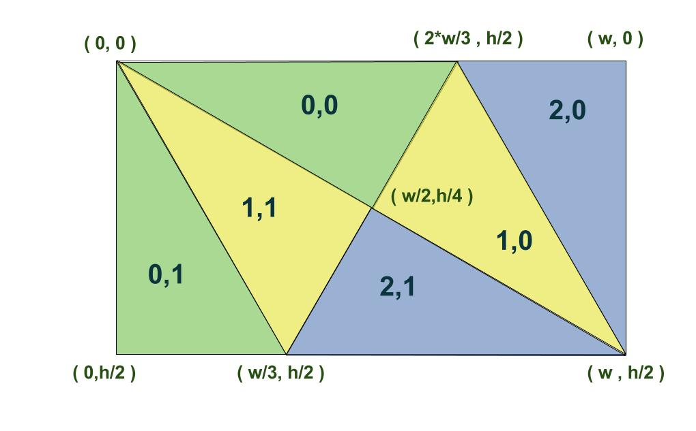
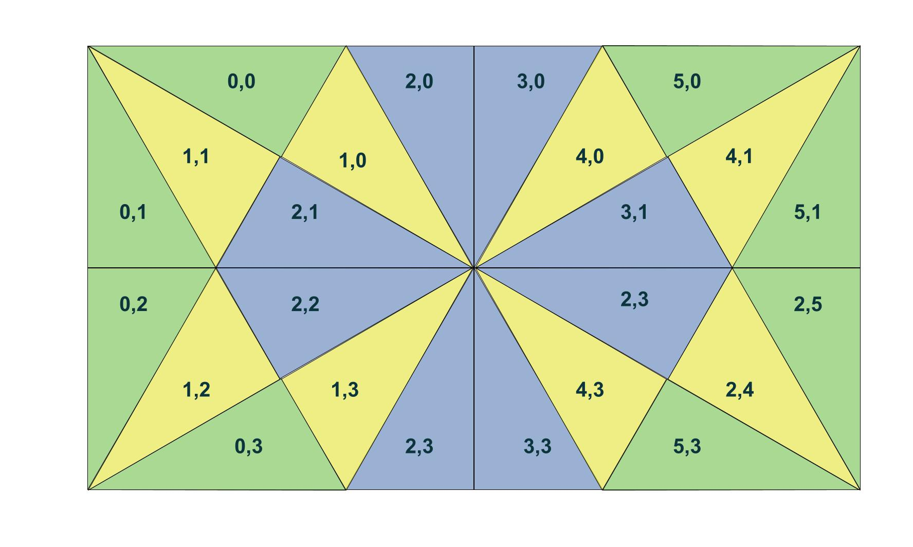
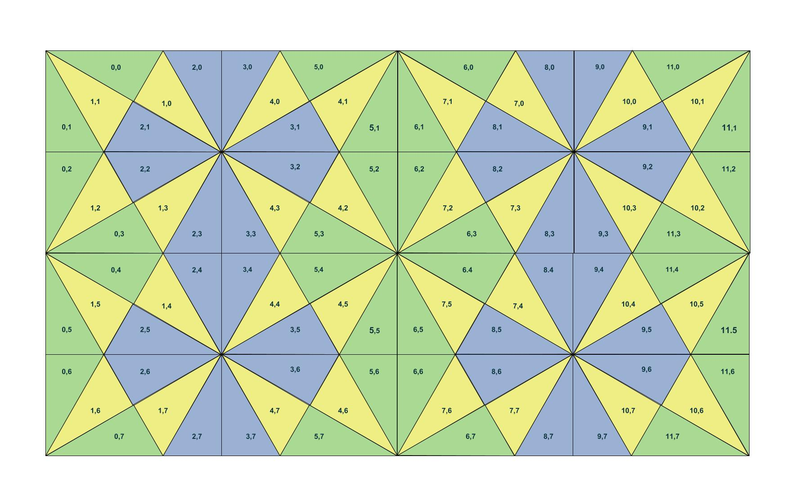
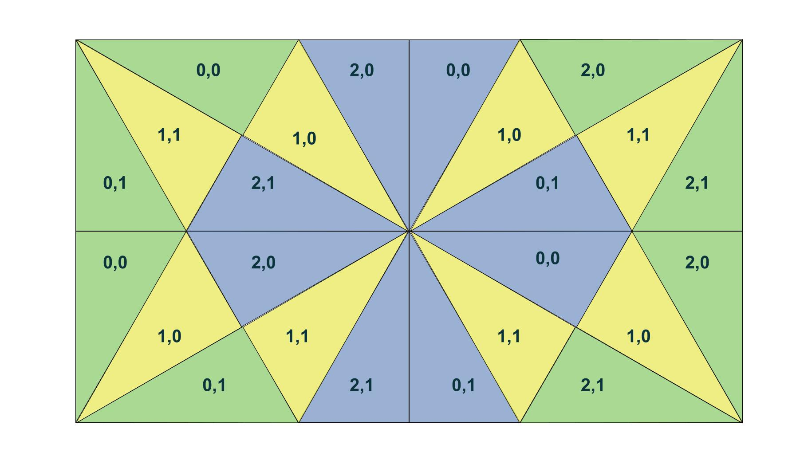
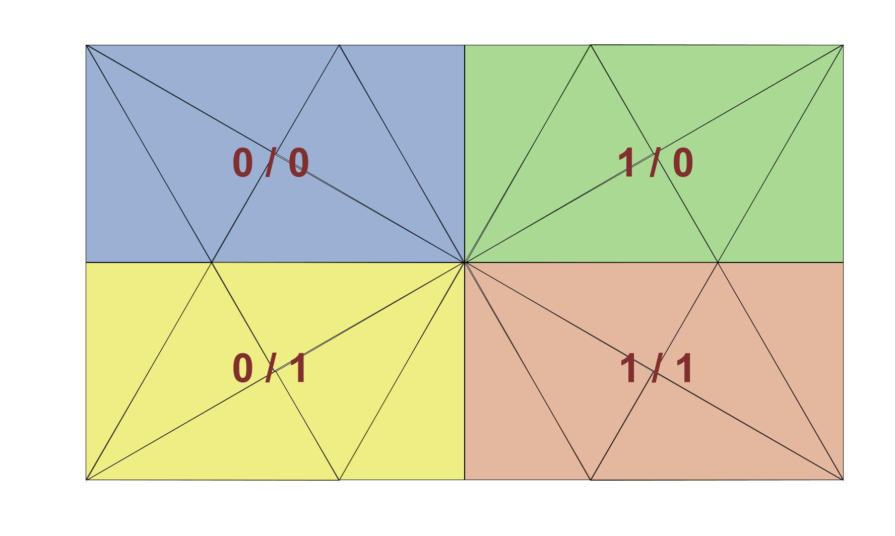
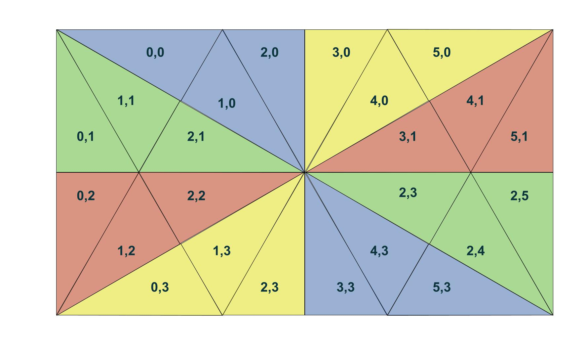
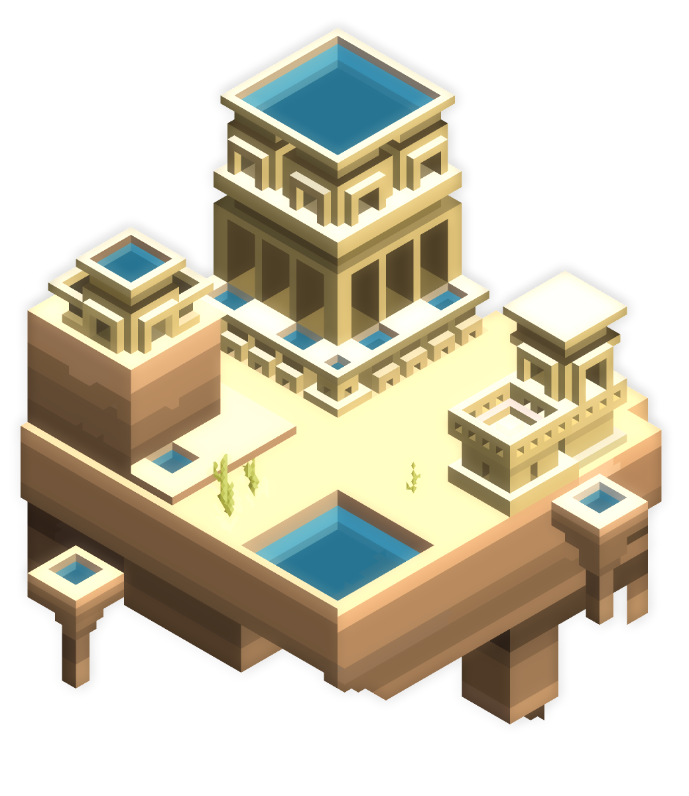
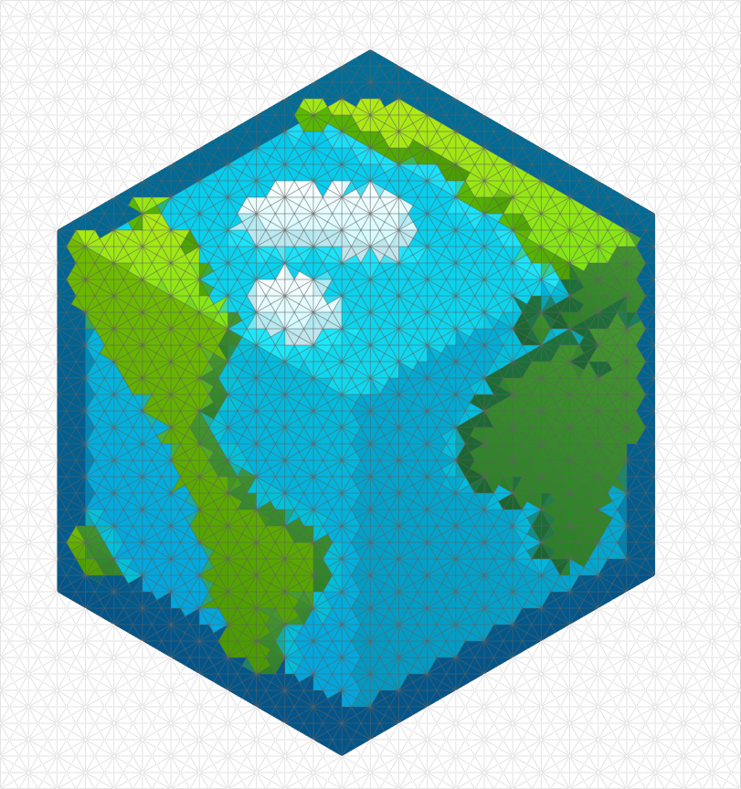
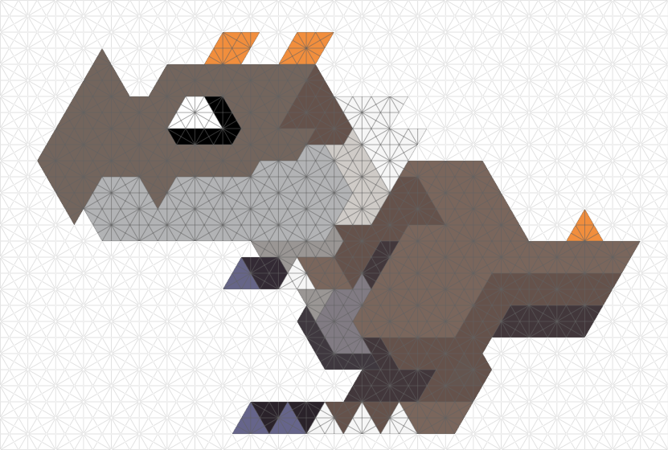
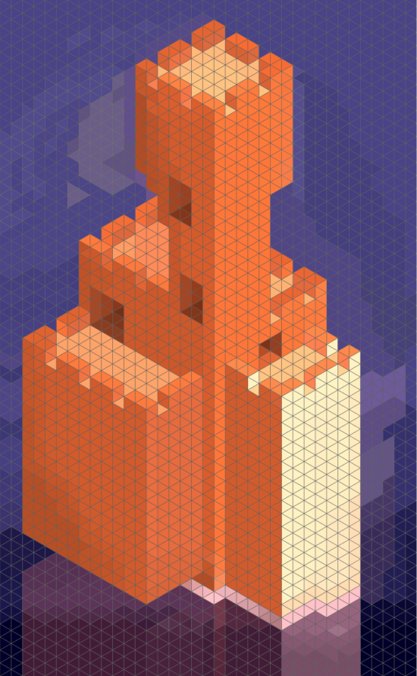

# TFTHexel
PixelArt graphics library for TFT Displays based on Hexels format to draw with several grid frames.

The library use different polygons in order to stablish different grids to draw in different formats:
<ul>
<li> Hexels</li>
<li> Trixels</li>
<li> Pixels</li>
</ul>

This differents interpretations on graphics allow us to create hexel in order to create 3D models on a 2D TFT Display with a different interpretation on depth figures.

This library need also:
<ul>
  <li>Adafruit_GFX.h</li>
  <li>Adafruit_ST7735.h</li
</ul>

Arduino Board read image information from SD card with a <a href="examples/hexelSD">.csv</a> exported from <a href="http://www.marmoset.co/hexels">Marmoset - Hexels 2</a> program.

  
  
  
  

Hexel grid class is based on geometric triangles ordered in columns and rows with the following structure: 

  
  
  

  
  
  

  
  
  

This library has been tested with Arduino Esplora and a TFT display. 

#define SD_CS    8  // Chip select line for SD card
 
#define TFT_CS  7  // Chip select line for TFT display
 
#define TFT_DC   0  // Data/command line for TFT
 
#define TFT_RST  1  // Reset line for TFT (or connect to +5V)

If you use another board, you can change your pins in <b>config.h</b>.

