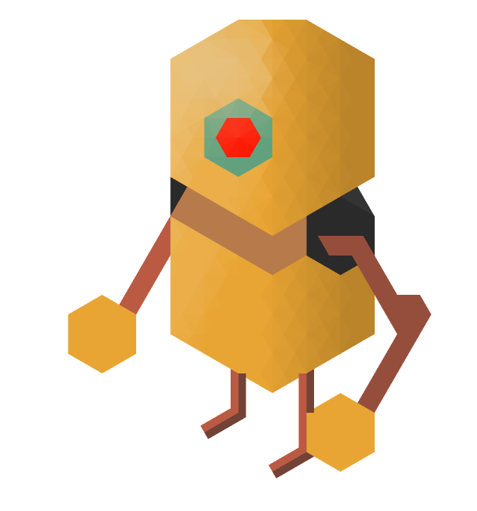

# TFTHexel
PixelArt graphics library for TFT Displays based on Hexels format to draw with several grid frames.

The library use different polygons in order to stablish different grids to draw in pixel format:
<ul>
<li> Hexels</li>
<li> Trixels</li>
<li> Pixels</li>
</ul>

This differents interpretations on graphics allow us to create voxels in order to create 3D models on a 2D TFT Display.

This library use transformation matrix for Arduino Esplora with TFT display. 

This library need:
<ul>
  <li>Adafruit_GFX.h</li>
  <li>Adafruit_ST7735.h</li>
</ul>

  
  
  
  

  
  
  
  

  
  
  

[]

